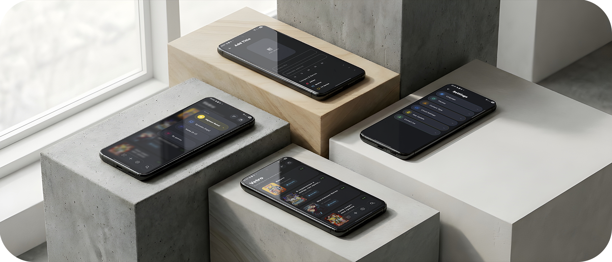
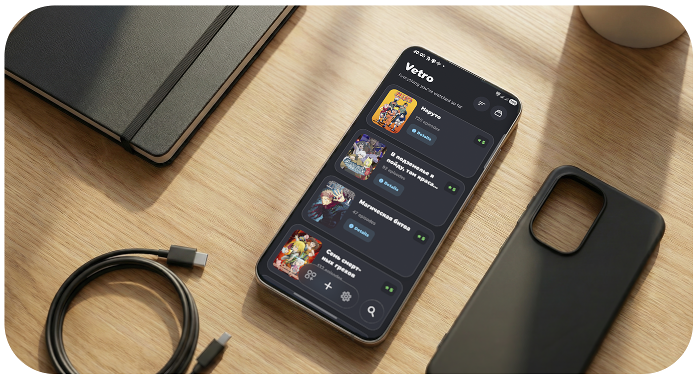
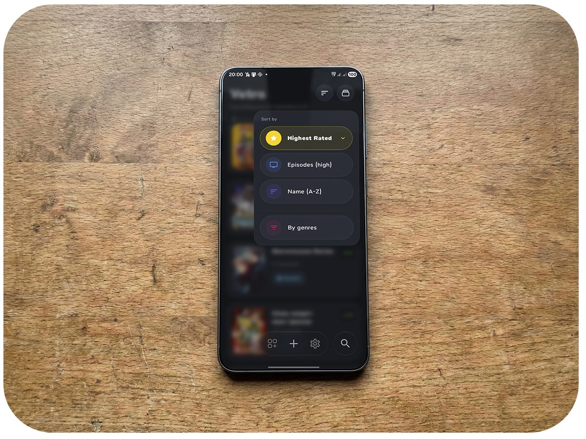
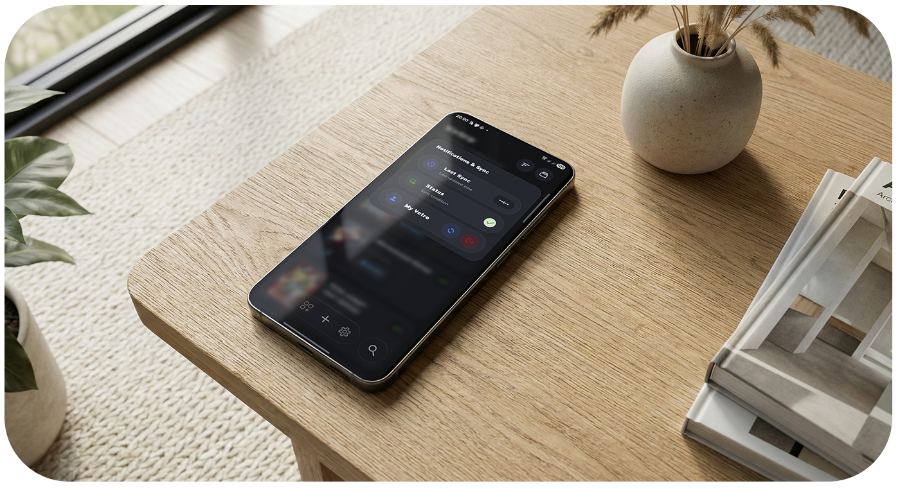
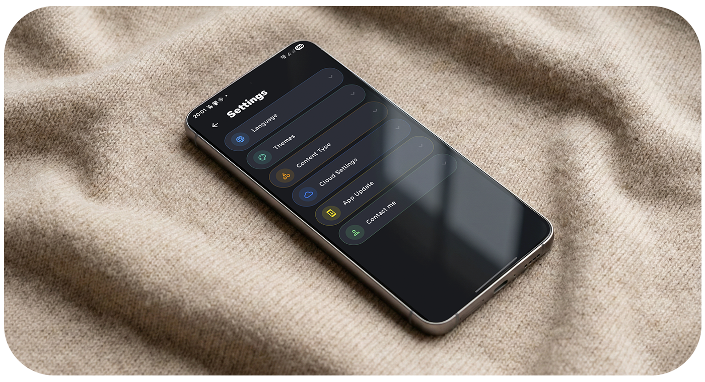
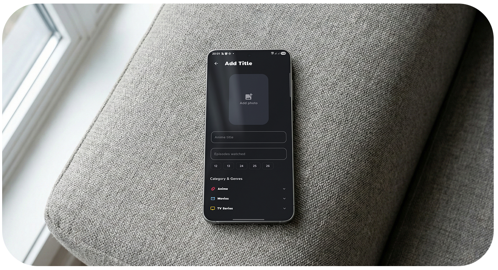
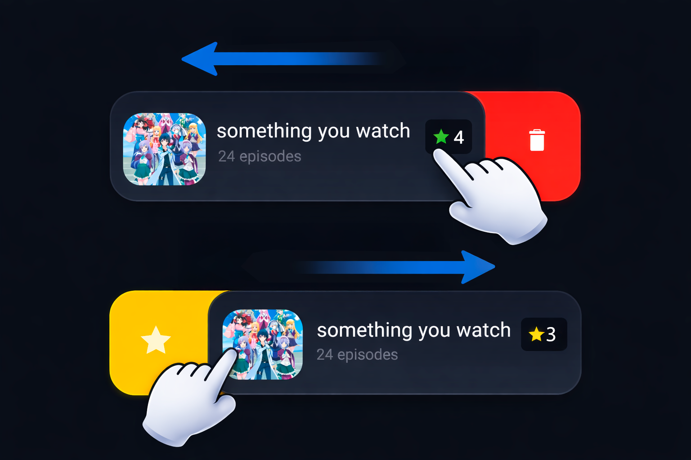

<h1 align="center">Vetra 🎬</h1>

  

  <b>Offline-first media tracker with modern glass UI and clean architecture.</b> 
  Anime · Movies · TV Shows · Anything structured.

  Kotlin · Compose · Ktor · Koin · SQLDelight

---

<h2 align="center">✨ What is Vetra?</h2>

Vetra is a powerful yet minimal list manager built with a strong **local-first philosophy**.

It was originally created as a personal anime tracker —  
but evolved into a flexible media management system with:

• modern glassmorphism UI  
• fully reactive data layer  
• clean modular architecture  
• optional cloud sync  
• smooth shared transitions  

---

<h2 align="center">📸 Screenshots</h2>

  
  
  
  
  

  <i>Click any image to view full resolution</i>

---

<h2>🧠 Core Philosophy</h2>

- 100% usable without internet  
- No forced accounts  
- Your data belongs to you  
- Cloud = extension, not requirement  
- Fast in-memory operations  
- Zero pagination lag  

---

<h2>✨ Features</h2>

<h3>📋 Content Management</h3>

- Custom lists (anime, shows, movies, etc.)
- Episode / progress tracking
- 1–5 star rating
- Favorites system
- Descriptions & metadata
- Real-time search & filtering (in-memory)

<h3>👉 Gestures</h3>

- Swipe to delete (with confirmation)
- Swipe to favorite
- Haptic feedback integration

  

---

<h2>🎨 UI / UX — Glass Era</h2>

Version 3 introduces a **full visual redesign**:

- Glassmorphism via Haze
- Frosted blur layers
- GlassActionDock
- GlassBottomNavigation
- SimpGlassCard components
- SharedTransitionScope animations
- Large expressive headers (One UI + iOS inspired)
- Dynamic typography
- Smooth Compose animations

This is no longer just a list app — it feels native, fluid, tactile.

---

<h2>☁️ Cloud Sync (Optional)</h2>

Dropbox-based synchronization:

- Direct file comparison via DropboxContentHasher
- No more delta sync complexity
- Automatic cloud folder migration  
  `/MAList → /Vetro`
- Full backup restore
- Cross-device migration in seconds

Architecture remains strictly local-first.

---

<h2>⚡ Performance Upgrade (v3.0.0-alpha)</h2>

Major architectural refactor:

✔ Removed Paging3  
✔ Single Flow database stream  
✔ In-memory filtering & sorting  
✔ Instant search  
✔ Reduced complexity  

Result: noticeably smoother scrolling and zero pagination stutter.

---

<h2>🏗 Architecture (3.0)</h2>

Dependency Injection:
- Koin
- appModule
- databaseModule
- networkModule
- viewModelModule
- Compose ViewModels via `koinViewModel()`

Networking:
- Migrated to Ktor (CIO engine)
- ContentNegotiation (kotlinx.serialization)
- Logging plugin
- Custom UserAgent
- Apollo GraphQL via KtorHttpEngine

Data:
- SQLDelight
- Flow-based repository
- Clean ViewModel separation

Background:
- AnimeUpdateReceiver (episode updates from notification shade)

---

<h2>🔐 Storage & Privacy</h2>

- 100% local storage by default
- JSON-based backups
- No analytics
- No tracking
- No hidden network calls

Local folder:

<pre>
Documents/Vetra
</pre>

You control everything.

---

<h2>🛠 Tech Stack</h2>

- Kotlin
- Jetpack Compose
- Koin (DI)
- Ktor (CIO)
- SQLDelight
- Gson / kotlinx.serialization
- Coil
- Dropbox API
- Haze (glass effects)

---

<h2>📂 Permissions</h2>

<b>MANAGE_EXTERNAL_STORAGE</b>  
Used strictly for managing local database and media storage.

---

<h2>🚀 Roadmap</h2>

- More advanced statistics
- Modular sync providers
- UI polish & performance tuning
- Stable 3.0 release

---

<h2>📜 License</h2>

MIT License