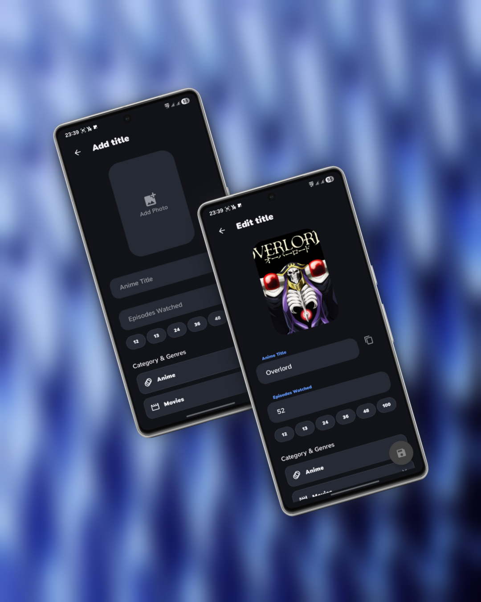
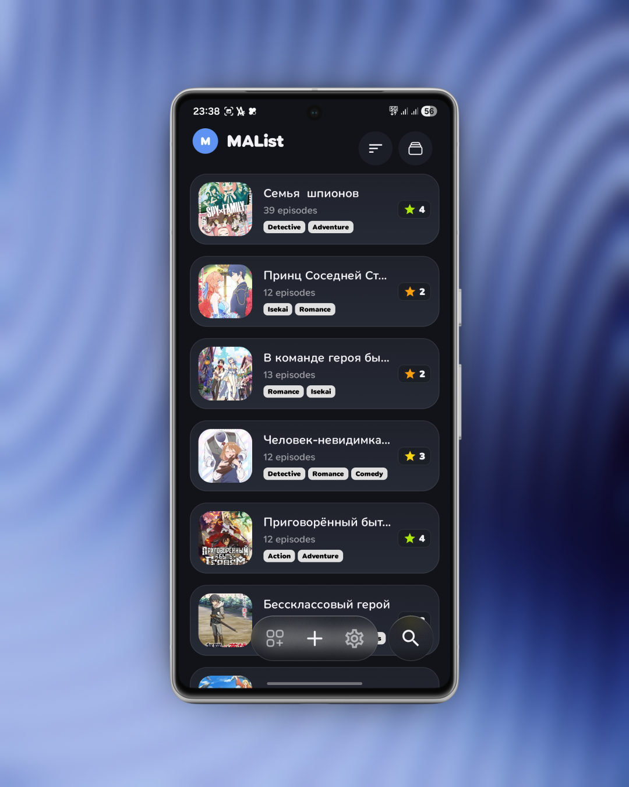
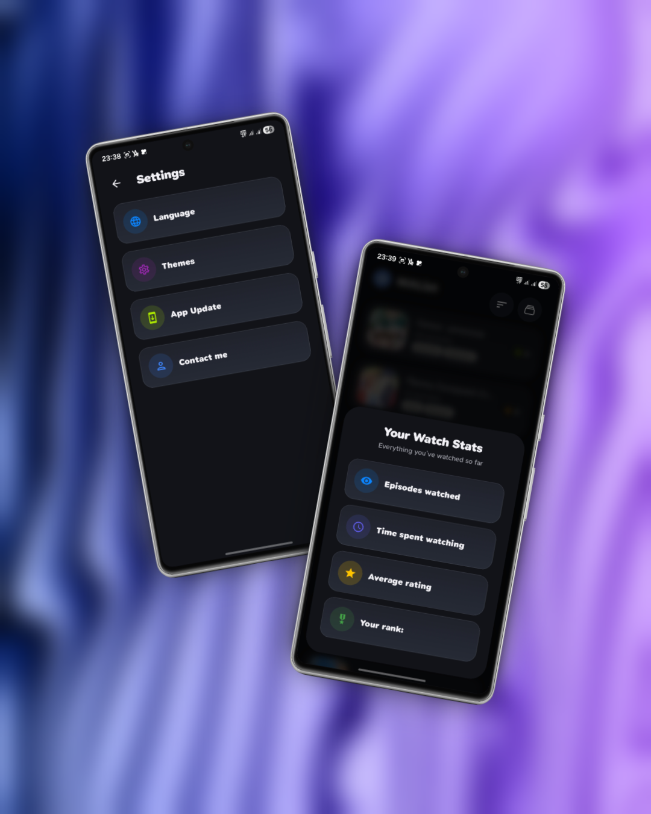
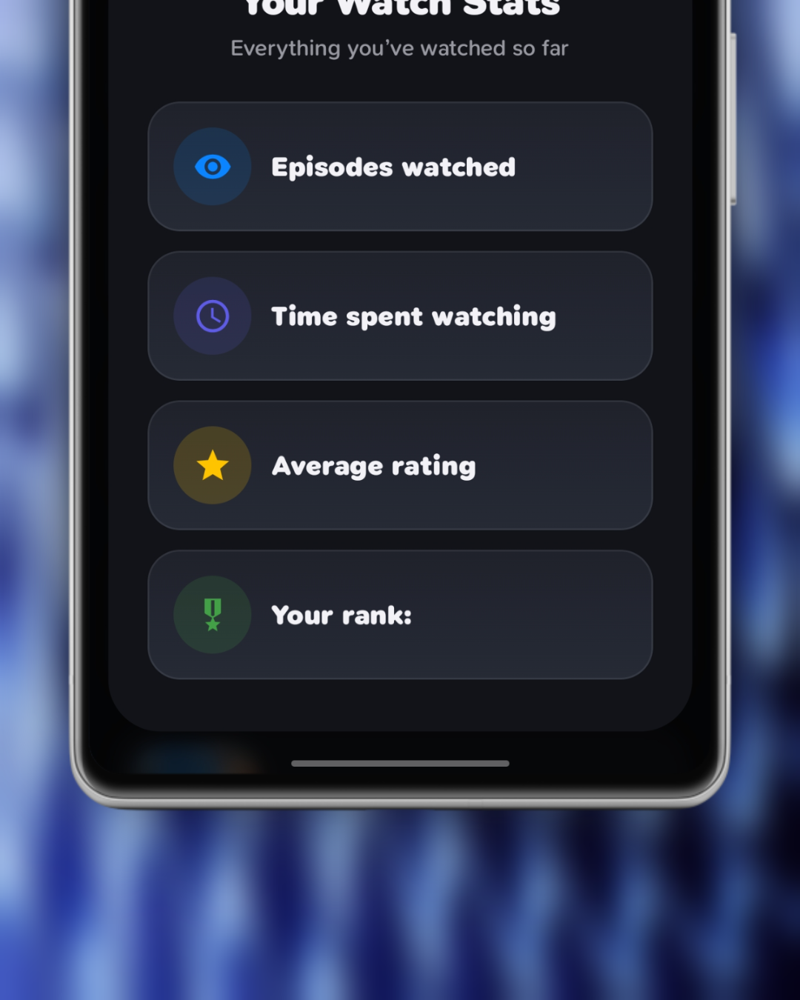
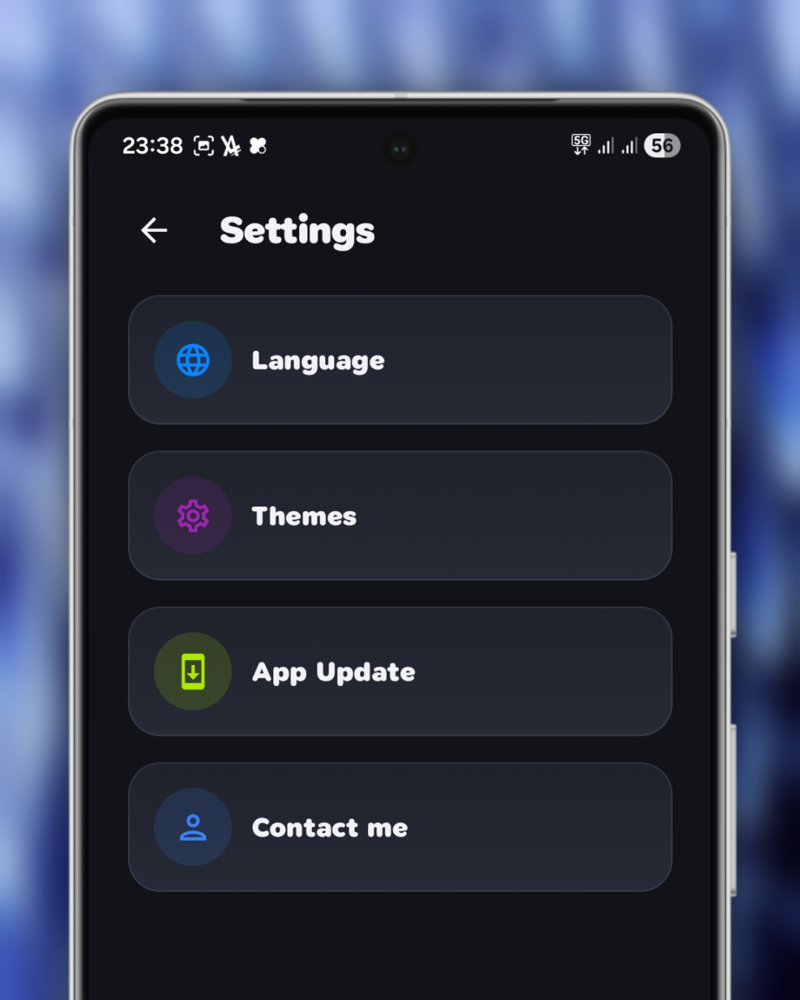
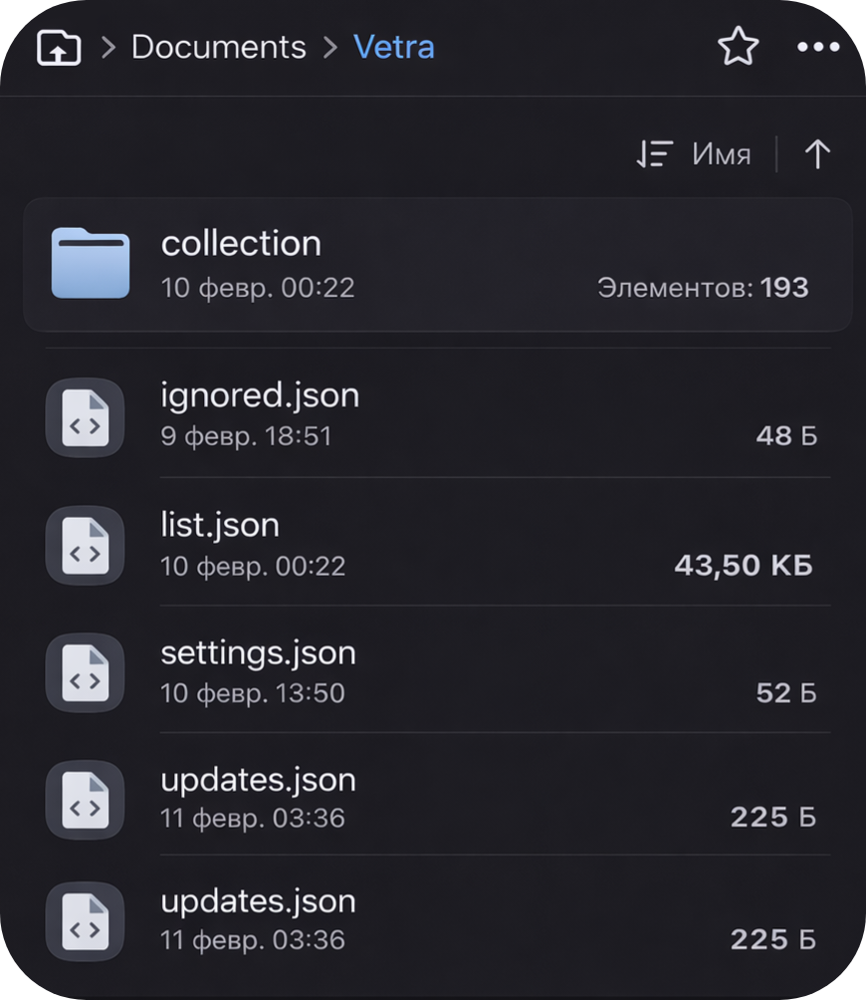

<h1 align="center">Vetra 🎬</h1>

  

  A simple, flexible, and fully offline-first list manager for anime, movies, TV shows, and more.

<h2 align="center">📸 Screenshots</h2>

<table align="center">
  <tr>
    <td></td>
    <td></td>
    <td></td>
    <td></td>
    <td></td>
  </tr>
</table>

<h2>📱 About</h2>

Vetra is a simple and flexible application for creating and managing lists.  
It is equally well suited for tracking anime, TV series, movies, or any other structured content.

This is my <b>first Kotlin project</b>, created primarily for personal use with a strong focus on clean UI/UX, smooth animations, and a local-first architecture.

<h2>✨ Features</h2>

<h3>📝 Core Functionality</h3>
<ul>
  <li>Create lists for any type of content</li>
  <li>Add custom titles and descriptions</li>
  <li>Episode / progress counter</li>
  <li>1–5 star rating system</li>
  <li>Favorites system</li>
</ul>

<h3>👉 Gestures</h3>
<ul>
  <li>Swipe to delete with confirmation</li>
  <li>Swipe to add items to Favorites</li>
</ul>

  

<h3>🎨 Interface & Customization</h3>
<ul>
  <li>Fully redesigned interface</li>
  <li>Light / Dark theme switching</li>
  <li>Language switching:
    <ul>
      <li>English</li>
      <li>Russian</li>
    </ul>
  </li>
  <li>Updated typography with new fonts</li>
  <li>Dozens of new icons</li>
</ul>

<h3>✨ Visuals & UX</h3>
<ul>
  <li>Reworked animations</li>
  <li>New visual effects</li>
  <li>Improved haptic feedback (vibration and tactile response)</li>
  <li>One UI + iOS–inspired design with large headers, rounded corners, and glass menus</li>
</ul>

<h2>☁️ Cloud Sync & Backup</h2>

<ul>
  <li>Automatic cloud synchronization via Dropbox</li>
  <li>Automatic background backups</li>
  <li>Restore lost or deleted data</li>
  <li>Transfer your entire library to a new device in seconds</li>
  <li>Local-first architecture — cloud is optional and works as an extension</li>
</ul>

Vetra keeps your data safe. Even if you change your device or accidentally delete something, your lists can be restored quickly.

<h2>🔄 Updates & Stability</h2>

<ul>
  <li>In-app update system</li>
  <li>Improved release tracking</li>
  <li>Improved statistics menu</li>
  <li>Fixed search functionality</li>
  <li>Numerous bug fixes and internal optimizations</li>
</ul>

<h2>💾 Storage & Privacy</h2>

<ul>
  <li><b>100% local storage by default</b></li>
  <li>No mandatory accounts</li>
  <li>No tracking</li>
  <li>Cloud sync is optional and user-controlled</li>
</ul>

The app creates its own folder:

<pre>
Documents/Vetra
</pre>

All data is stored locally in JSON format and can be synchronized securely with your Dropbox account.

<h2>🛠 Technical Stack</h2>

<ul>
  <li><b>Language:</b> Kotlin</li>
  <li><b>UI:</b> Jetpack Compose</li>
  <li><b>Animations:</b> Compose Animations & Shared Element Transitions</li>
  <li><b>Architecture:</b> ViewModel</li>
  <li><b>Data Storage:</b> JSON (Gson)</li>
  <li><b>Image Loading:</b> Coil (local image rendering)</li>
  <li><b>Cloud Integration:</b> Dropbox API</li>
</ul>

  

<h2>📂 Permissions</h2>

Vetra may request the following permission:

<ul>
  <li>
    <b>MANAGE_EXTERNAL_STORAGE</b> 
    Used to create and manage the app's local database and image storage.
  </li>
</ul>

<h2>📜 License</h2>

This project is licensed under the <b>MIT License</b>.

