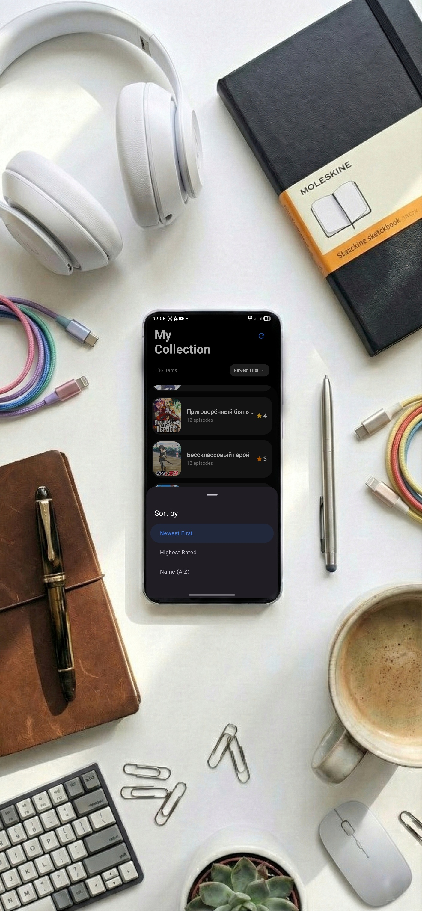

<h1 align="center">MAList 🎬</h1>

  

  A simple, flexible, and fully offline list manager for anime, shows, and more.

<h2>📱 About</h2>

MAList is a simple and flexible application for creating lists.  
Originally developed for anime tracking, it can also be used for TV shows, movies, or even shopping lists.

This is my <b>first Kotlin project</b>, created purely for my own personal needs and preferences, with a strong focus on UI/UX, smooth animations, and local-first data storage.

<h2>✨ Features</h2>

<h3>📝 Core Functionality</h3>
<ul>
  <li>Create lists for any type of content</li>
  <li>Add custom titles and descriptions</li>
  <li>Episode / item counter</li>
  <li>1–5 star rating system</li>
  <li>Favorites system</li>
</ul>

<h3>👉 Gestures</h3>
<ul>
  <li>Swipe to delete with confirmation</li>
  <li>Swipe to add items to Favorites</li>
</ul>

<h3>🎨 Interface & Customization</h3>
<ul>
  <li>Fully redesigned interface</li>
  <li>Light / Dark theme switching</li>
  <li>Language switching:
    <ul>
      <li>en English</li>
      <li>🇷🇺 Russian</li>
    </ul>
  </li>
  <li>Updated typography with new fonts</li>
  <li>Dozens of new icons</li>
</ul>

<h3>✨ Visuals & UX</h3>
<ul>
  <li>Reworked animations</li>
  <li>New visual effects</li>
  <li>Improved haptic feedback (vibration and tactile response)</li>
  <li>One UI–inspired design with large headers and rounded corners</li>
</ul>

<h3>🔄 Updates & Stability</h3>
<ul>
  <li>In-app update system</li>
  <li>Improved release tracking</li>
  <li>Improved statistics menu</li>
  <li>Fixed search functionality</li>
  <li>Numerous bug fixes and internal optimizations</li>
</ul>

<h2>💾 Storage & Privacy</h2>

<ul>
  <li><b>100% local storage</b></li>
  <li>No accounts, no cloud, no tracking</li>
  <li>All data and images are stored locally on your device</li>
</ul>

The app creates its own folder:

<pre>
Documents/MyAnimeList
</pre>

All data is stored locally in JSON format.

<h2>🛠 Technical Stack</h2>

<ul>
  <li><b>Language:</b> Kotlin</li>
  <li><b>UI:</b> Jetpack Compose</li>
  <li><b>Animations:</b> Compose Animations & Shared Element Transitions</li>
  <li><b>Architecture:</b> ViewModel</li>
  <li><b>Data Storage:</b> JSON (Gson)</li>
  <li><b>Image Loading:</b> Coil (local image rendering)</li>
</ul>

  

<h2>📂 Permissions</h2>

MAList requires the following permission:

<ul>
  <li>
    <b>MANAGE_EXTERNAL_STORAGE</b> 
    Used to create and manage the app's local database and image storage.
  </li>
</ul>

<h2>📜 License</h2>

This project is licensed under the <b>MIT License</b>.

<h2 align="center">📸 Screenshots</h2>

<table align="center">
  <tr>
    <td></td>
    <td></td>
    <td></td>
    <td></td>
    <td></td>
  </tr>
</table>
