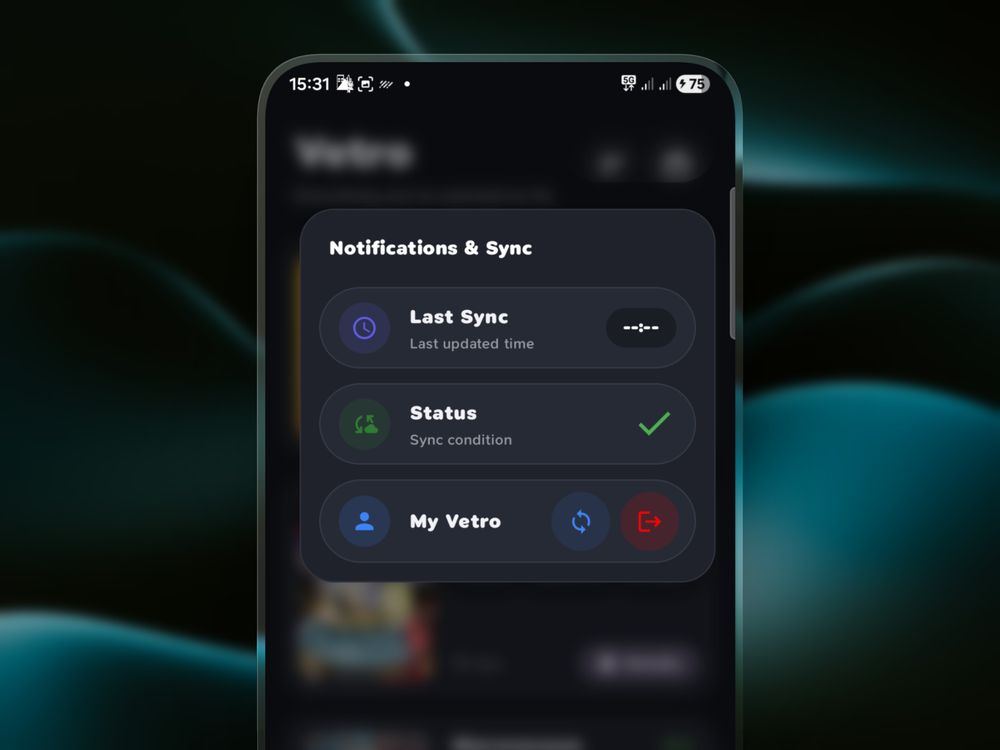
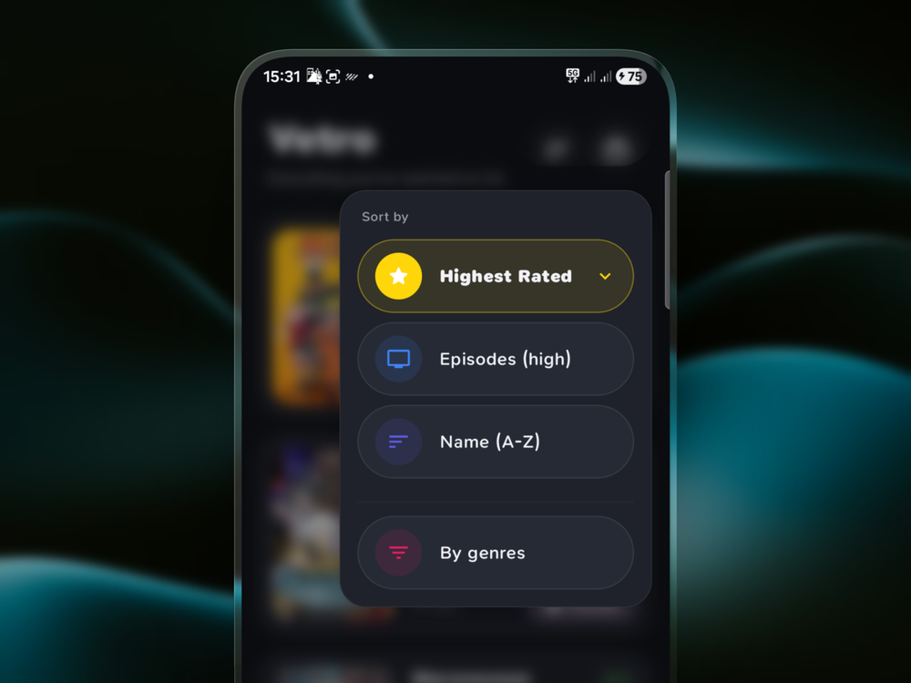
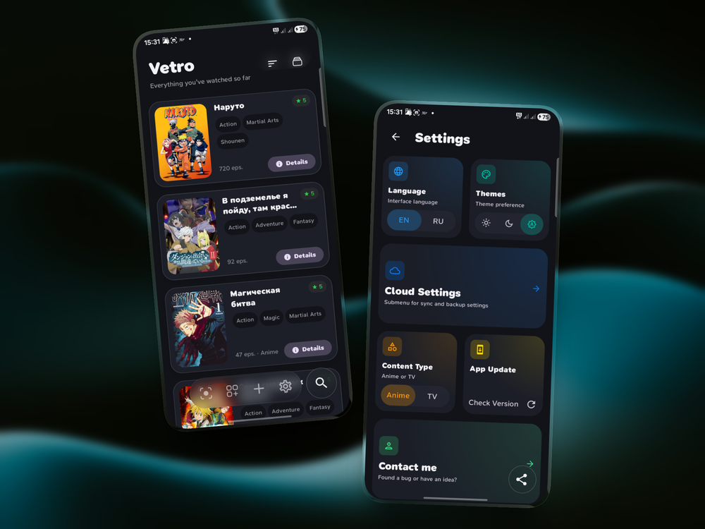
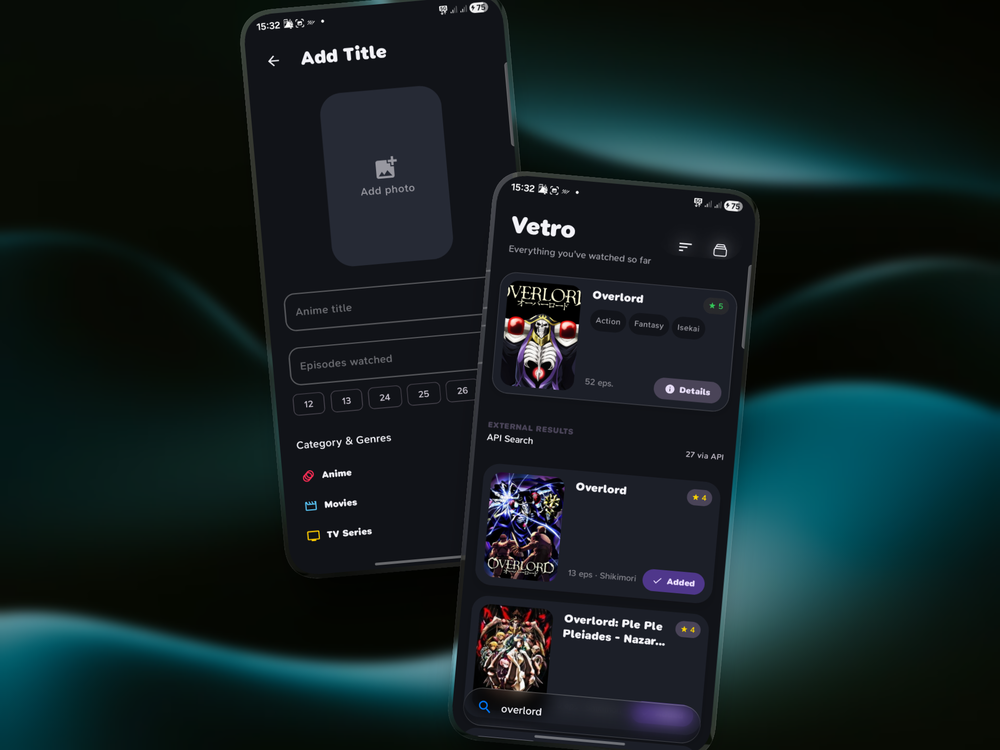
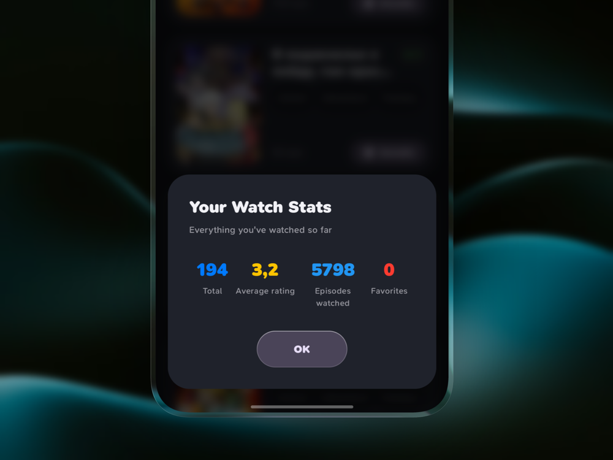
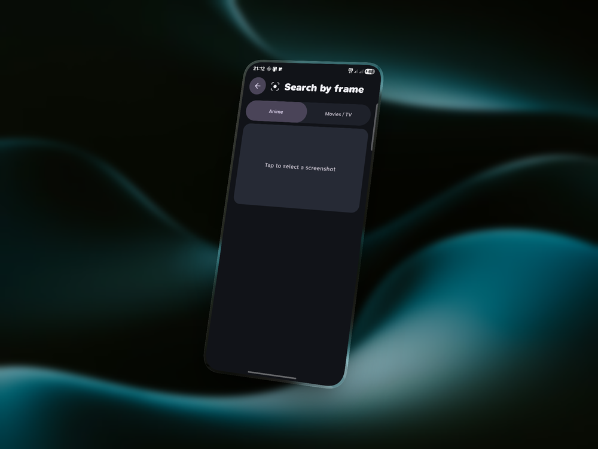
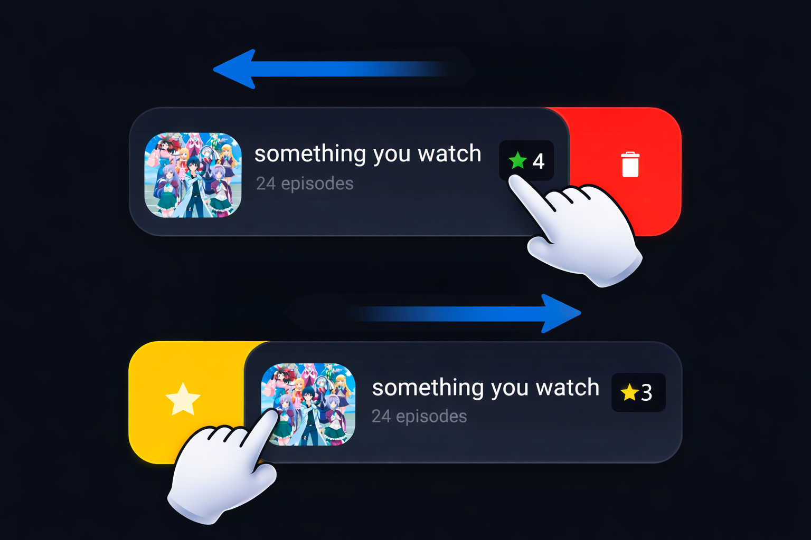

<h1 align="center">Vetra 🎬</h1>

  

  <b>Offline-first media tracker with modern glass UI and clean architecture.</b> 
  Anime · Movies · TV Shows · Anything structured

  Kotlin · Compose · Ktor · Koin · SQLDelight

---

<h2 align="center">✨ What is Vetra?</h2>

Vetra is a powerful yet minimal **local-first media manager**.

Originally built as a personal anime tracker, it evolved into a flexible and scalable system with:

• modern glass UI  
• strict unidirectional data flow (UDF / MVI)  
• clean architecture (Domain-driven)  
• reactive data layer (Flow + SQLDelight)  
• optional cloud sync  
• advanced search (API + image recognition)

---

<h2 align="center">📸 Screenshots</h2>

  
  
  
  
  
  

  <i>Click any image to view full resolution</i>

---

<h2>🧠 Core Philosophy</h2>

- 100% usable offline
- No forced accounts
- Your data belongs to you
- Cloud = extension, not requirement
- Instant UI response (no fake delays)
- Deterministic state & predictable behavior

---

<h2>✨ Features</h2>

<h3>📋 Content Management</h3>

- Custom lists (anime, movies, shows, etc.)
- Episode / progress tracking
- Rating system
- Favorites
- Comments & notes
- Fully reactive data updates

<h3>🔍 Advanced Search</h3>

- Real-time in-memory search
- API search (movies + anime)
- Auto-fetch metadata (cover, description, rating)

<h4>🧠 Image-based search (v3.1.x)</h4>

- Identify content from a screenshot
- Anime → trace.moe
- Movies → AI recognition

Workflow:

- Upload frame → detect title
- Add directly to library
- Auto-fill metadata
- Genres editable manually

<h3>👉 Gestures</h3>

- Swipe to delete
- Swipe to favorite
- Haptic feedback

  

---

<h2>🎨 UI / UX — Glass Era</h2>

Vetra 3.x introduces a fully reimagined UI system:

- Glassmorphism (Haze)
- Hardware-accelerated blur with fallback
- GlassActionDock & Bottom Navigation
- Unified GlassIconButton system
- Tile-based settings (3.1.x)
- Redesigned Details screen
- Predictive Back support
- Physics-based animations
- Calm, spacious layout system (3.1.x)

Result:

- smoother perception
- cleaner hierarchy
- modern tactile feel

---

<h2>🏗 Architecture (3.x)</h2>

<h3>Clean Architecture</h3>

- UI / Domain / Data separation
- UseCases for business logic:
  - SaveAnimeUseCase
  - UpdateCommentUseCase
  - GetAnimeForEditUseCase

- DTO layer (SaveAnimeParams)
- No Android dependencies in ViewModels

<h3>State Management</h3>

- Strict UDF (Unidirectional Data Flow)
- Immutable UI state
- SideEffects via Channel
- No callback anti-patterns

<h3>Data Layer</h3>

- SQLDelight + Flow
- Fully reactive DB
- Single source of truth
- In-memory filtering & sorting

<h3>Dependency Injection</h3>

- Koin 4.x
- Fully modular graph
- No legacy singletons

<h3>Networking</h3>

- Ktor (CIO)
- Apollo GraphQL
- Improved API pipeline (3.1.x)
- Structured error handling

---

<h2>⚡ Performance</h2>

Key improvements since 3.0:

- Removed Paging3 → no pagination lag
- Reduced recompositions
- Optimized LazyColumn behavior
- Haze GPU optimization
- Image loading optimization (Coil 3.x)
- XML removal → no runtime parsing cost

Result:

- smooth scrolling
- instant search
- stable rendering

---

<h2>☁️ Cloud Sync (Optional)</h2>

Dropbox-based sync:

- File hashing (DropboxContentHasher)
- No delta sync complexity
- Safe DB restore (WAL fix)
- Migration: `/MAList → /Vetro`

Architecture remains local-first.

---

<h2>🔐 Storage & Privacy</h2>

- 100% local by default
- No analytics
- No tracking
- No hidden network calls

Local folder:
